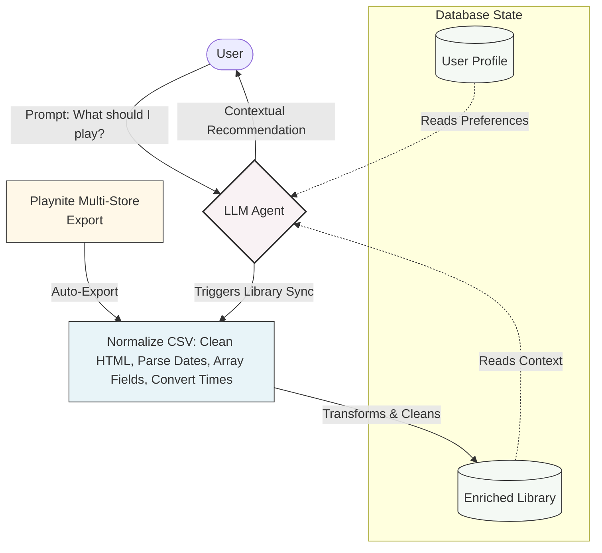

# Agentic Game Librarian

An event-driven Agentic AI pipeline that syncs my fragmented game libraries, learns my hardware and habits and uses natural language to recommend the perfect game for my current mood.

[Placeholder for UI/Terminal Demo Image]

## The Problem

I am a gamer with a massive "backlog" of games, fragmented across multiple storefronts. Many were acquired during sales or claimed as free gifts, leaving me with a library so large, I rarely know what I actually own.

Scrolling through this catalog is a chore, especially when I only have 60 minutes to play or want to find a specific experience for a game night. Traditional storefront algorithms fail me because they rely on tags that capture mechanics, not mood. I needed a unified system that understands my immediate mood and recommends what I should play right now.

## The Solution

An Agentic AI application that acts as a personal librarian with direct access to my entire gaming library, enriched with metadata. It interviews me to learn my hardware constraints, typical session lengths and emotional preferences. By conversing in natural language, the agent learns my tastes over time, providing highly contextual, mood-based recommendations pulled directly from the games I already own.

## Features & Skills

Built on the **agentskills.io** framework.

- **Update Profile Skill**: Initializes user profiles on first-run and refines preferences on subsequent interactions. Collects PC hardware facts, play styles, and mood-based preferences through conversational reasoning.
- **Update Library Skill**: An ETL pipeline that reads Playnite's multi-store CSV export and transforms it into a clean file, enriched with full metadata.
- **Agentic Reasoning**: Synthesizes library data with current mood to explain why a specific game matches your exact context today.

## Core Architecture 

Initial architecture used custom Python ETL scripts querying the IGDB API. However, the pipeline was refactored to use Playnite as an automated background ETL agent, reducing custom codebase size by 60% while maintaining identical data output.

## Getting Started

### 1. Environment Setup

Clone the repository, and install dependencies. This project assumes the user already has Playnite installed and set up, with its library file exported in the project folder.

### 2. Run the Agent

Start an interactive session using an Agentic framework of your choice (e.g., Cline, Copilot). The agent will automatically trigger the profile update skill (initializing your profile if empty), execute the ETL pipeline to sync your games, then open a conversational loop for recommendations.

## Future Work

- **Recommendation Skill**: Add a dedicated skill for explicit instructions when generating personalized game recommendations.
- **Linux Support**: Linux gaming is a thing now. Add OS-awareness to the update-profile skill to filter recommendations based on ProtonDB compatibility for Linux/Steam Deck users.
- **Deep Metadata Enrichment**: Integrate APIs for richer metadata, such as the Co-Optimus API (for exact local/online player counts) or HowLongToBeat (for session planning).