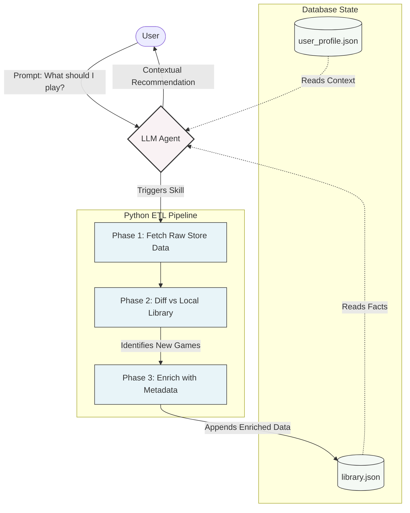

# Agentic Game Librarian

An event-driven Agentic AI pipeline that syncs my fragmented game libraries, learns my hardware and habits and uses natural language to recommend the perfect game for my current mood.

[Placeholder for UI/Terminal Demo Image]

## The Problem

I am a gamer with a massive "backlog" of games, fragmented across multiple storefronts. Many were acquired during sales or claimed as free gifts, leaving me with a library so large, I rarely know what I actually own.

Scrolling through this catalog is a chore, especially when I only have 60 minutes to play or want to find a specific experience for a game night. Traditional storefront algorithms fail me because they rely on tags that capture mechanics, not mood. I needed a unified system that understands my immediate mood and recommends what I should play right now.

## The Solution

An Agentic AI application that acts as a personal librarian with direct access to my entire gaming library, enriched with metadata. It interviews me to learn my hardware constraints, typical session lengths and emotional preferences. By conversing in natural language, the agent learns my tastes over time, providing highly contextual, mood-based recommendations pulled directly from the games I already own.

## Features & Skills

Built on the **agentskills.io** framework.

- **Autonomous Onboarding**: Conducts an interview to build a user persona (hardware specs, session lengths, thematic preferences).
- **ETL Pipeline** (`update-library`): A Python-driven Extract, Transform, Load pipeline that diffs my local library against storefront exports and enriches new titles via the IGDB API.
- **Agentic Reasoning**: Synthesizes my library data with my current mood to explain why a specific game matches my exact context today.

## Core Architecture 

    
## Getting Started

### 1. Environment Setup

Clone the repository, set up your environment variables, and install dependencies. Edit .env with your Steam and Twitch/IGDB developer credentials.

### 2. Run the Agent

Start an interactive session using an Agentic framework of your choice (e.g., Cline, Copilot). The agent will automatically trigger the onboarding interview (if no profile is found), execute the ETL pipeline to sync your games, then open a conversational loop for recommendations.

## Future Work

- **Automated Storefront Integration**: Replace the manual custom Python scrapers with a Playnite automated JSON export. This will unify all store libraries into a single background sync, reducing the custom codebase footprint while expanding platform coverage.
- **Recommendation Skill**: Add a dedicated skill for explicit instructions when generating personalized game recommendations.
- **Linux Support**: Linux gaming is a thing now. Add OS-awareness to the onboarding skill to filter recommendations based on ProtonDB compatibility for Linux/Steam Deck users.
- **Deep Metadata Enrichment**: Integrate more APIs for richer metadata, such as the Co-Optimus API (for exact local/online player counts) or HowLongToBeat (for session planning).